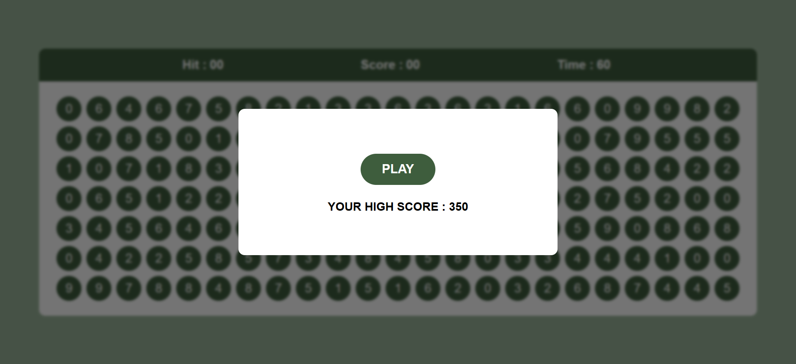
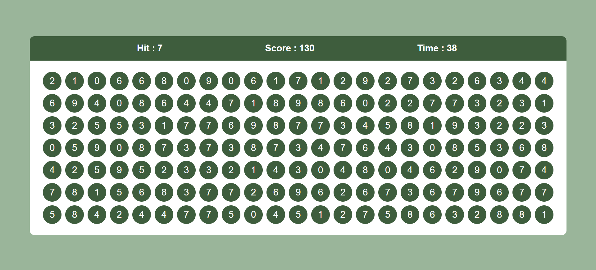
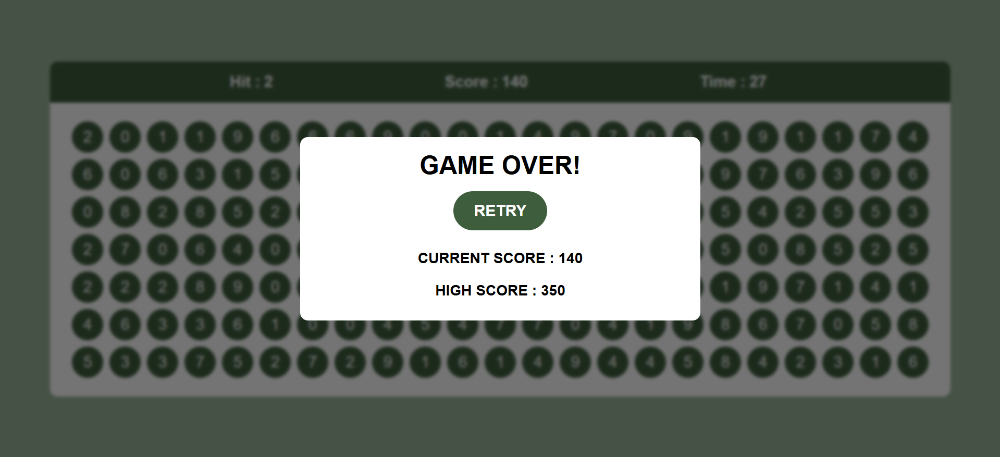

# 🎯 Bubble Game

A fun and fast-paced browser-based **Bubble Game** built using **HTML, CSS, and JavaScript**.  
Test your speed and accuracy by clicking the correct bubbles before time runs out!

---

## 🚀 Live Demo

👉 (Add your live link here if hosted)

---

## 🎮 How to Play

- A random **target number (Hit)** is displayed.
- Multiple bubbles with numbers are generated.
- Click the bubble that matches the **target number**.
- ✅ Correct click → Score increases
- ❌ Wrong click → Game Over
- ⏱ You have **60 seconds** to score as much as possible!

---

## ✨ Features

- 🎯 Dynamic bubble generation
- ⏱ 60-second countdown timer
- 💯 Real-time score tracking
- 🧠 Random target number (Hit system)
- 🏆 High score tracking using **localStorage**
- 🔁 Game Over & Restart functionality
- ⚡ Fast and responsive gameplay

---

## 🛠️ Technologies Used

- **HTML** – Structure of the game
- **CSS** – Styling and layout
- **JavaScript** – Game logic & interactivity
- **DOM Manipulation** – Dynamic updates
- **Event Handling** – Click events

---

## 🖼️ Screenshots

### ▶️ Start Screen

### 🎮 Gameplay

### ❌ Game Over

---

## 🧩 Game Logic

- Random bubbles (0–9) are generated dynamically.
- A random "Hit" number is displayed.
- When user clicks:
  - If match → score increases by **10**
  - If not → game ends
- Timer runs for **60 seconds**
- High score is stored using **localStorage**

---

## 📂 Project Structure

Bubble-Game/
│── index.html # Main HTML file (structure of the game)
│── style.css # Styling and layout of the game
│── script.js # Game logic and functionality
│── README.md # Project documentation
│
└── images/ # Screenshots and assets
├── play-game.png
├── gameplay.png
└── game-over.png

---

👤 **moleeekkk**  
GitHub: https://github.com/moleeekkk

---

## 💡 Future Improvements

- Add sound effects 🔊
- Mobile optimization 📱

---

## ⭐ Support

If you like this project, give it a ⭐ on GitHub!
